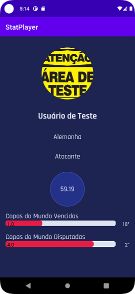

<h1 align="center">
  
</h1>

  

 

  

## 💻 Projeto
Programa desenvolvido em Android Nativo - Kotlin

## ✨ Tecnologias

-   [ ] Adroid Nativo
-   [ ] Kotiln
-   [ ] Retrofit
-   [ ] Coroutines
-   [ ] Glide
-   [ ] Rest Api (http://sportsmatch.com.br/)

## 📄 Licença

Esse projeto está sob a licença MIT. Veja o arquivo [LICENSE](LICENSE.md) para mais detalhes.

 
